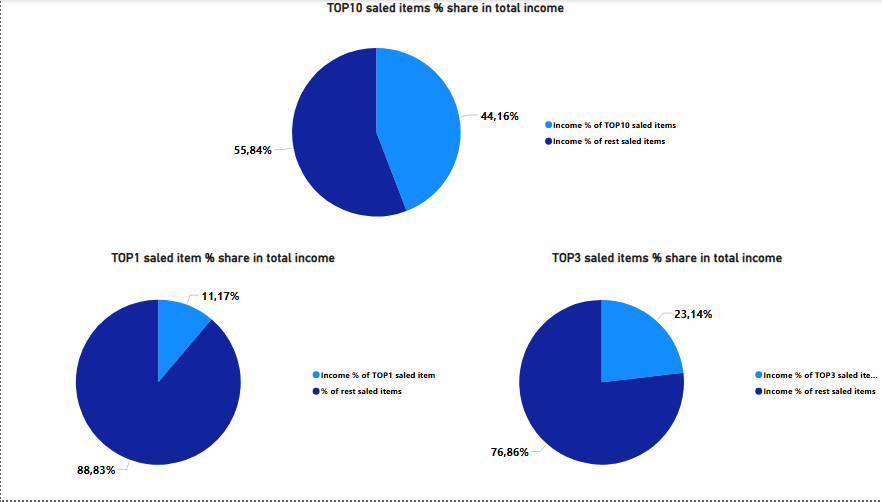
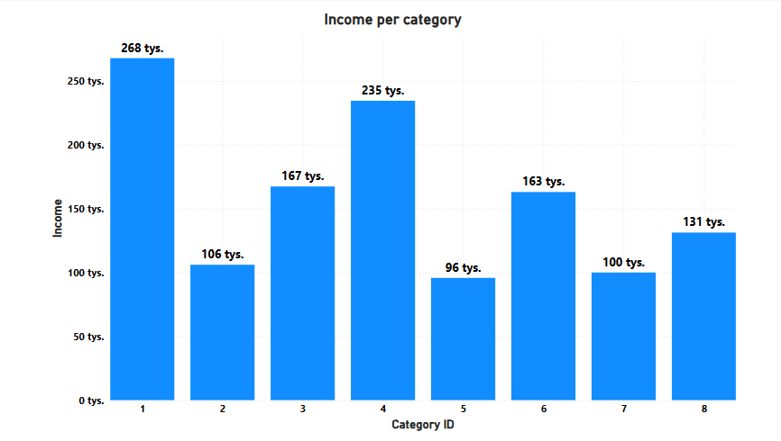

**Northwind Sales Analysis 📊📊**

I've analyzed Northwind 2000 Database from Kaggle.

Main tool to prepare analysis: Excel.

Additional tools: Power BI + SQL.

**Dashboards 📉📈**

**Conclusions ✅**

➡ The most saled item generated 11,17% of total income,

➡ Top 3 saled items generated 23,14% of total income,

➡ Top 10 saled items generated 44,16% of total income,

➡ CategoriesID: 1, 3 and 4 are TOP3 categories generating the most income. They stand for 52,91% of total income value.

**Tools Used 🔧**

**Power BI** - to create dashboards and visualize data

**SQL** - mainly SELECT queries, to extract data from data base

**Excel** - to organise and prepare the data using:

➡ LOOKUP formula,

➡ SUMIF and SUM formulas,

➡ PIVOT tables.

**Data Source**

[Northwind 2000 Database](https://www.kaggle.com/datasets/munawarsaudagar/northwind-2000-sqlite) — Kaggle (2,155 orders, 77 products, 8 categories, 21 countries)
